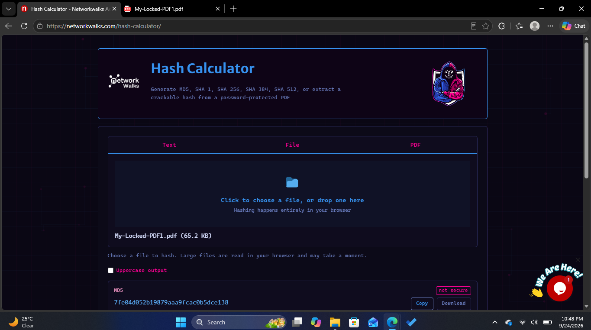
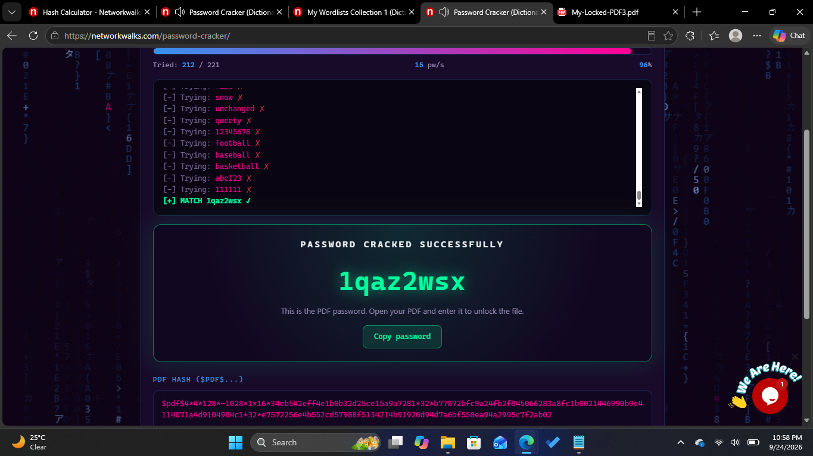
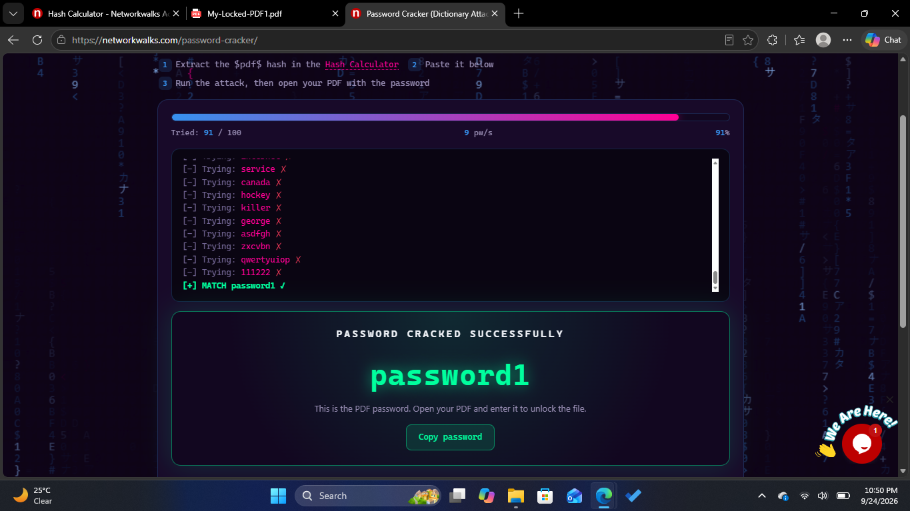
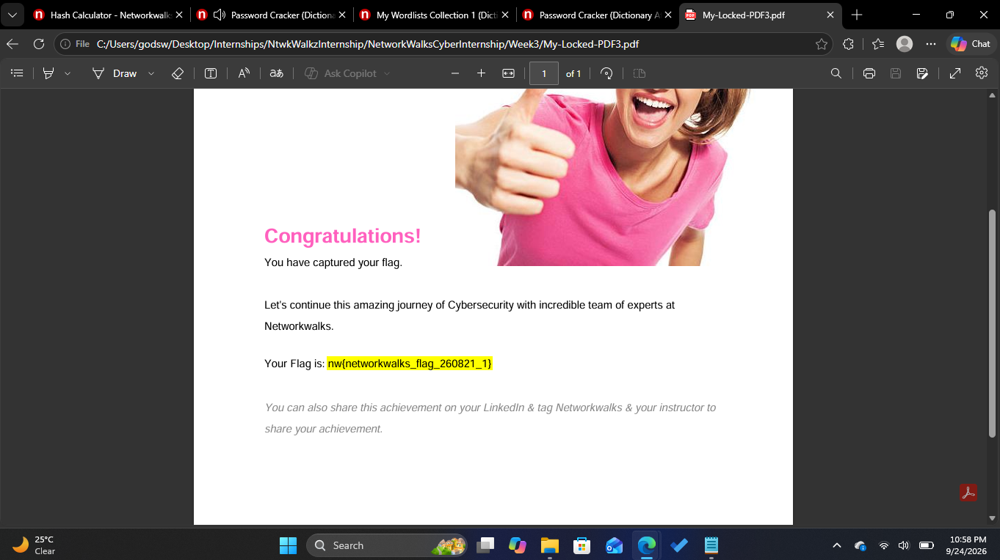
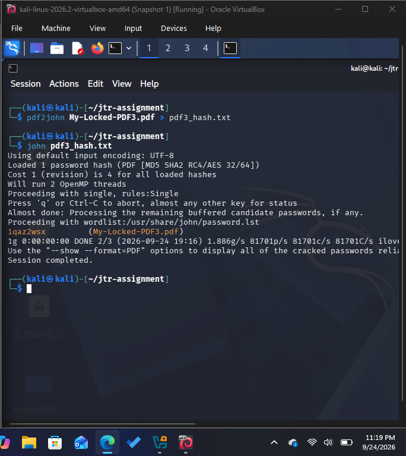

# Password Cracking Lab: PDF Password Recovery

> **Disclaimer:** This assessment was conducted strictly for authorized cybersecurity training as part of the NetworkWalks internship. The testing scope was limited to password-protected PDF files provided by the lab for this exercise. No unauthorized systems, accounts, files, or third-party data were targeted. All techniques and tools were used within the defined laboratory environment.

## 1. Assessment Overview

### Objective

The objective of this exercise was to demonstrate the process of recovering passwords from protected PDF documents using hash-based password-cracking techniques.

The assessment evaluated two approaches:

1. **NetworkWalks Hash Calculator and Password Cracker**
2. **John the Ripper with `pdf2john`**

Three password-protected PDF files were supplied as laboratory targets. The first two were processed using the NetworkWalks tools, while the third was assessed using John the Ripper.

---

## 2. Assessment Scope

| Item               | Details                                                                                  |
| ------------------ | ---------------------------------------------------------------------------------------- |
| Target type        | Password-protected PDF documents                                                         |
| Number of targets  | 3                                                                                        |
| Environment        | Authorized cybersecurity laboratory ( Windows * Linux)                                                      |
| Primary techniques | Hash extraction and wordlist-based password cracking                                     |
| Tools              | NetworkWalks Hash Calculator, NetworkWalks Password Cracker, John the Ripper, `pdf2john` |
| Authorization      | NetworkWalks internship laboratory exercise                                              |

The assessment was restricted to the files supplied for the exercise.

---

## 3. Methodology

### 3.1 NetworkWalks Hash Calculator and Password Cracker

The first two PDF targets were assessed using the NetworkWalks Hash Calculator and Password Cracker.

The process consisted of:

```text
Protected PDF
      ↓
Hash Calculation
      ↓
Extracted Hash
      ↓
Password Cracker + Wordlist
      ↓
Recovered Password
      ↓
PDF Access Verification
```

The PDF was first processed by the Hash Calculator to obtain the value required by the password-cracking component. The resulting hash was then submitted to the Password Cracker together with the applicable wordlist.

A successful recovery was confirmed by using the recovered password to open the corresponding PDF.

### Evidence

*Figure 1 — Hash generation for the supplied PDF.*


*Figure 2 — Password recovery using the supplied hash and wordlist.*



*Figure 3 — Verification of the recovered password by opening the protected document.*



The same methodology was applied to the second supplied PDF, resulting in successful password recovery and document access.

---

## 4. John the Ripper Assessment

The third PDF was assessed using John the Ripper.

### 4.1 Tool Verification

The John the Ripper installation was verified before beginning the assessment:

```bash
john --version
```

### 4.2 PDF Hash Extraction

Because John the Ripper operates on password hashes rather than directly on the PDF document, the PDF password hash was first extracted using `pdf2john`.

```bash
pdf2john My-Locked-PDF3.pdf > PDF3_hash.txt
```

This generated a hash file containing the information required for the password-cracking process.

### 4.3 Password Cracking

The extracted hash was supplied to John the Ripper:

```bash
john PDF3_hash.txt
```

John successfully recovered the password from the supplied hash.

*Figure 4 — Successful password recovery using John the Ripper.*


The recovered credential was subsequently validated by opening the protected PDF.

*Figure 5 — Validation of the recovered password against the original PDF.*


---

## 5. Results

All three laboratory targets were successfully processed and their passwords recovered.

| Target | Method                                          | Result             |
| ------ | ----------------------------------------------- | ------------------ |
| PDF 1  | NetworkWalks Hash Calculator + Password Cracker | Password1 |
| PDF 2  | NetworkWalks Hash Calculator + Password Cracker | Password1 |
| PDF 3  | `pdf2john` + John the Ripper                    | 1qaz2wsx |

John the Ripper completed the password recovery process faster than the NetworkWalks Password Cracker during this exercise. The observed difference demonstrates that cracking performance can vary between tools and implementations depending on factors such as the cracking method, wordlist, optimization, and processing environment.

---

## 6. Security Analysis

Password-protected documents can be vulnerable to offline password-cracking attacks when an attacker obtains the underlying file hash.

The assessment demonstrates the following attack chain:

```text
Protected Document
       ↓
Hash Extraction
       ↓
Offline Password Guessing
       ↓
Password Recovery
       ↓
Unauthorized Document Access
```

The primary security weakness demonstrated by this exercise is the use of passwords that can be recovered through dictionary or wordlist-based guessing.

Once a password is successfully recovered, the protection applied to the document can effectively be bypassed without modifying the document itself.

This highlights the importance of using **long, unique, and unpredictable passwords** for protected documents and other systems where offline password attacks may be possible.

---

## 7. Key Findings

### Finding 1 — Passwords Recoverable Through Wordlist-Based Cracking

**Severity:** Dependent on password strength and document sensitivity

The supplied PDF passwords were successfully recovered using wordlist-based password-cracking techniques.

**Security implication:**
Commonly used passwords provide limited resistance against offline password-cracking attacks.

**Recommendation:**
Use long, unique passwords or passphrases that are not based on common words, predictable patterns, or easily guessable information.

### Finding 2 — Offline Cracking Does Not Require Repeated Access Attempts

Once the required password hash has been obtained, password guessing can be performed offline.

**Security implication:**
Unlike an online login attack, offline cracking is not necessarily constrained by account lockouts, rate limiting or login-attempt restrictions.

**Recommendation:**
Protect password hashes and encrypted files appropriately and use strong passwords with modern cryptographic protection.

---

## 8. Conclusion

This assessment demonstrated the practical workflow involved in recovering passwords from password-protected PDF documents.

Two approaches were evaluated: the NetworkWalks Hash Calculator and Password Cracker, and the command-line combination of `pdf2john` and John the Ripper.

All three authorized laboratory targets were successfully recovered. The exercise demonstrates how weak or predictable passwords can reduce the effectiveness of document-level password protection when an attacker is able to obtain the necessary hash data.

The assessment was conducted entirely within the authorized scope of the NetworkWalks internship and against files supplied specifically for the laboratory exercise.
